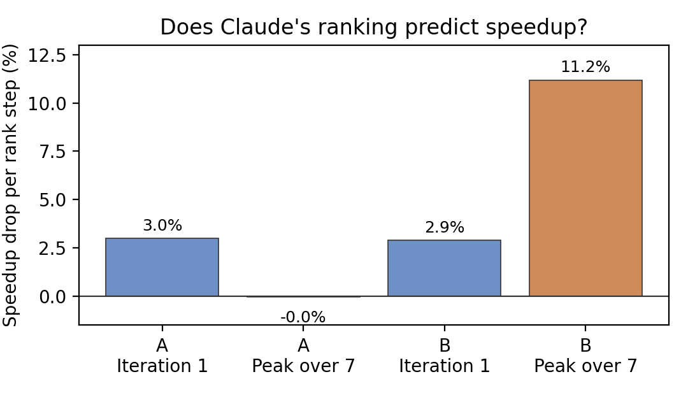
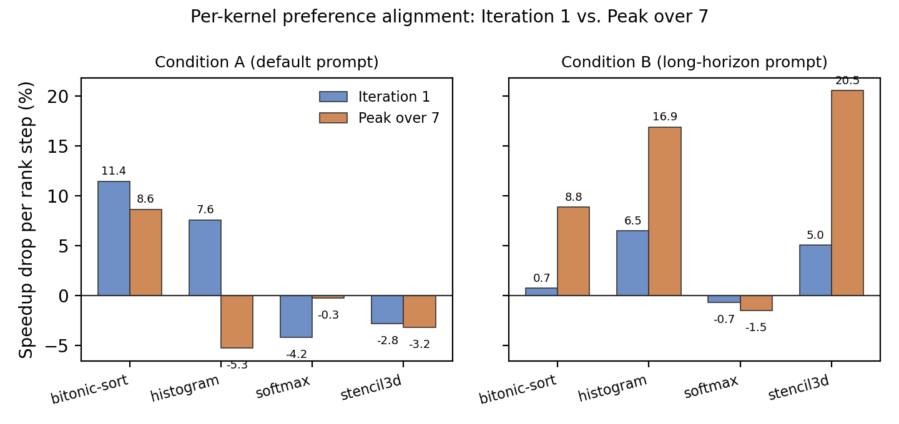
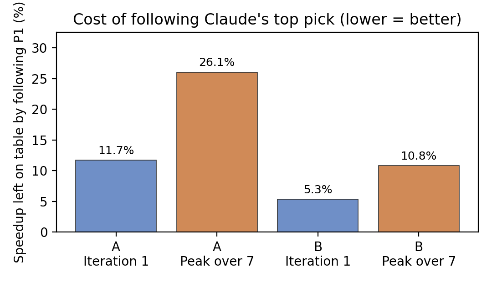

# Are Coding Agents Too Greedy?
### Measuring Short-Horizon Bias in LLM-Driven GPU Kernel Optimization

> **Kuan-Lei Wu · Sheng Chen · Young Lee**

GPU kernel optimization is path-dependent: a first edit that yields a quick speedup can consume registers, reduce occupancy, and block better long-term directions. This repository contains the full experiment studying whether Claude's optimization preference is aligned with short-term payoff, longer-horizon peak speedup, or neither — and what happens when you explicitly tell it to plan for the latter.

---

## Key Results

**Claude's default ranking predicts immediate speedup (3.0% per rank step) but essentially nothing about final speedup (~0%).** A single targeted prompt change — asking Claude to rank by trajectory value rather than first-step appeal — raises final-speedup alignment to **11.2% per rank step** and cuts the cost of blindly following its top pick from **26.1% to 10.8%**.

### Does Claude's ranking predict speedup?



*Each rank step lower in Claude's preference ordering corresponds to 3.0% less speedup at iteration 1 (blue) but near-zero loss in final peak speedup (orange) under the default prompt. The long-horizon prompt closes this gap: final-speedup alignment rises to 11.2% per rank step.*

### Per-kernel breakdown



*The aggregate hides a sharp pattern. Histogram A has a final-speedup penalty of **−5.3%**: Claude's default top pick is actively worse than random for that kernel. Condition B corrects this for three of four kernels; softmax stays near zero in both conditions.*

### Cost of following Claude's top pick



*How much speedup is left on the table by following Claude's P1 instead of the best available direction. Lower is better. The long-horizon prompt cuts this cost substantially, especially for final speedup.*

---

## Why Prompting Has a Ceiling

The softmax kernel shows the limit. In both conditions Claude correctly identified the bottleneck (94.5% memory stalls) but chose the wrong lever. Condition A P1 reduced global reads from three passes to one — but occupancy collapsed from 74.1% to 30.7%. Condition B P1 implemented an algorithmically elegant online softmax — but simple block-size tuning (P5) won both conditions by improving scheduler utilization.

**Knowing the symptom is not the same as knowing the root cause.** The missing layer is not profiler awareness — Claude already reads profiler output — but structured verification of which metric is the actual bottleneck versus a downstream effect, and what resource cost a chosen lever pays.

Stencil3d B shows the success case: Claude correctly identified float precision conversion as the foundational change, occupancy rose from 79.6% to 96.7%, and a coherent dependency chain of coalescing and tiling improvements reached **4.985×**.

---

## Method

A **Planner/Worker** harness separates Claude's *preference* from its *implementation behavior*:

1. **Planner** — Claude reads kernel source and profiling data, then generates and ranks five candidate optimization plans before any implementation occurs
2. **Worker** — Each plan is executed independently by a separate Claude Code session for a fixed budget of 7 correctness-checked iterations
3. **Two conditions** — Condition A (default: rank by what you'd try first) vs. Condition B (long-horizon: rank by expected peak speedup after 7 iterations)
4. **Four kernels** from [HecBench](https://github.com/zjin-lcf/HeCBench) — bitonic-sort, histogram, softmax, stencil3d — each selected for having a readable profiling bottleneck and multiple plausible optimization directions

This is a qualitative case study; reported numbers are descriptive observations rather than significance-tested claims.

| Metric | Definition |
|---|---|
| Speedup drop per rank step | Linear regression slope of speedup on rank position (1–5) |
| Alignment gap | Iteration-1 signal minus final-speedup signal |
| Cost of following P1 | `(s_best − s_1) / s_best` across all five directions |

---

## Repository Layout

```
report/                 LaTeX source and plot assets
analysis/
  data/                 Computed metric CSVs
  generated_plots/      All figures (PDF + PNG)
  scripts/              compute_metrics.py — regenerates all metrics and plots
experiments/
  <kernel>/cond_<A|B>/
    README.md           Planner prompt surface (condition-specific)
    response.json       Claude's ranked plan output
    workers/branch_<1-5>/
      README.md         Worker prompt surface
      LOG.md            Worker iteration log with profiler evidence
      out/run_*/run.json Per-iteration timing and correctness results
baselines/              Baseline timing and profiler summaries
```

---

## Reproduce Analysis

```bash
python3 analysis/scripts/compute_metrics.py
```

Reads `analysis/report_artifacts/branch_summary.csv` and writes all metric CSVs, plots, and paper assets.

---

## Report

Full paper: [`report/final_report.tex`](report/final_report.tex)

```bash
cd report
pdflatex final_report.tex && pdflatex final_report.tex
```
